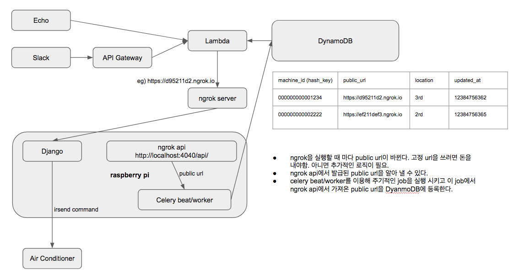

# 들어가기에 앞서
- 본 프로젝트는 외부에 공개되어 있으므로 민감한 정보가 프로젝트에 추가되지 않도록 주의해주세요.
- 개발 환경은 OSX 기준으로 되어있습니다.

# 프로젝트 목표
- 사무실 내 3대의 에어컨을 음성 제어를 이용해 편하게 켜고 끄는게 목표입니다.
- 에어컨 2대는 같은 브랜드, 다른 한대는 다른 브랜드라서 에어컨을 켤 때 리모콘을 두 개 찾아야 하는 불편함이 있는데 이를 해결하여 에어컨 리모컨을 찾는데 들어가는 시간을 절약하여 업무 효율성을 높이자.

# TODO
- [X] [회로도 그리기](#회로도)
- [X] 빵판에 회로 만들기
- [X] 리모컨에서 나오는 ir신호 캡쳐
- [ ] 캡쳐된 ir신호 발신기 conf 파일 셋업
- [ ] irsend 이용해 에어컨 제어하기
- [ ] 서버 셋업
- [X] ngrok을 활용한 고정 public ip 할당
- [X] 도커 배포 환경 구축
- [ ] 모든 배포 환경 자동화
- [X] 만능 기판에 ir발신기 회로 구성
- [X] 아마존 에코 연동
- [ ] 슬랙으로 에어컨 켜고/끄기
- [X] 3일 이상 켜놔도 문제없이 동작하는지 확인


# 회로도

Download [fritzing file(.fzz)](air-conditioner.fzz)


# 어플리케이션 구조도

[원본](https://docs.google.com/presentation/d/10ZRbJJHFH7znxYNwCARpbbcZcShggCh8eihLedmicmc/edit#slide=id.p)


# 회로 구성
## 준비물
- [라즈베리파이 3](http://www.eleparts.co.kr/EPXGNNFF)
- USB 아답터 2.5A 이상
- MLC SD card 16기가 -> Sandisk micro sd extreme 16GB 구매
- [빵판 or 라즈베리파이 입출력키트](http://www.eleparts.co.kr/EPXDTWPM) - 귀찮으면 입출력키트 지르자
- lirc에서 설정하는 gpio_in_pin 등의 번호는 pin 번호가 아닌 gpio 번호를 사용해야한다. 

# 개발 환경

## 라즈비안 설치 without monitor & keyboard
- [SD Card Formatter](https://www.sdcard.org/downloads/formatter_4/) 받아서 SD카드 포맷
- https://www.raspberrypi.org/downloads/raspbian/ 에서 이미지 받고 압축 풀어서 .img 파일을 실행시키면 boot volume이 마운트된다
- 기본으로 ssh가 꺼져 있기 때문에 켜기 위해서 아래처럼 파일을 생성해준다
```bash
sudo touch /Volumes/boot/ssh
```

- 아래 파일을 열어서 내용추가
```bash
sudo vi /Volumes/boot/wpa_supplicant.conf
```
```
network={
  ssid="YOUR_NETWORK_NAME"
  psk="YOUR_NETWORK_PASSWORD"
  key_mgmt=WPA-PSK
}
network={
  ssid="YOUR_NETWORK_NAME2"
  psk="YOUR_NETWORK_PASSWORD"
  key_mgmt=WPA-PSK
}
```
- 실제로 SD카드에 올라가고 나면 /etc/wpa_supplicant/wpa_supplicant.conf 위치에서 같은 파일 찾을 수 있다 
- [pi-baker](https://www.tweaking4all.com/software/macosx-software/macosx-apple-pi-baker/) 받아서 Restore Back으로 img파일 굽기
- network에서 라즈베리파이 찾기
```
which apr || brew install arp-scan
arp -a | grep b8:27:eb | grep -Eo '[0-9]{1,3}\.[0-9]{1,3}\.[0-9]{1,3}\.[0-9]{1,3}'

or
which nmap || brew install nmap
nmap -sn 192.168.1.0/24
```
- ssh pi@xxx.xxx.xxx.xx with password raspberry

- sudo raspi-config 실행해서 ssh 비번 바꾸기
- mkdir ~/.ssh -> vi ~/.ssh/authorized_keys 실행해서 public key 넣어놓기
- ansible로 필요한것들 설치
```bash
cd deploy/rpi/ansible
ansible-playbook -i hosts setup_rpi.yml
```

## Docker
- https://www.docker.com/docker-mac


## sshfs 설정
- https://www.raspberrypi.org/documentation/remote-access/ssh/sshfs.md
- 맥에서 아래 명령 수행
```
brew install Caskroom/cask/osxfuse
brew install sshfs
mkdir pi
sshfs pi@192.168.0.109: pi
```


## LIRC 이용한 적외선 신호 발신기 등록 및 신호 송신

- LIRC(Linux Infrared Remote Control) : http://www.lirc.org/html/configuration-guide.html
- 라이브러리 및 환경 설정은 다 되어있다는 가정

1. IR receiver 와 lirc 간 연계 테스트 : 셋업해 둔 IR receiver 가 lirc 로 정상적으로 IR 신호를 전달하고 있는지 확인용.

```bash
sudo /etc/init.d/lirc stop // lirc deamon 중단
mode2 -d /dev/lirc0
```

실행 후 IR 송신기의 버튼을 눌렀을 때 터미널에 `space, pulse` 등의 문자가 출력되면 정상.

2. irrecord 이용해 송신기의 환경 설정 파일 생성
- lirc 가 중지된 상태여야 함
```bash
irrecord -d /dev/lirc0 --disable-namespace -f ~/lircd.conf
```
- `--disable-namespace` : 각 키에 할당할 수 있는 lable의 리스트가 원래 정해져 있는데, 사용할 label을 직접 정의해서 사용하려고 하는 경우 추가. 원래 정의할 수 있는 label 리스트는 `irrecord --list-namespace` 로 조회 가능.

3. samsung ac 인식
- irrecord 대신에 mode2 사용해야함
```
sudo mode2 -m -d /dev/lirc0 > ~/lirc.conf
```

# 이슈
- docker for mac clock skew
```
https://github.com/docker/for-mac/issues/17
맥이 잠자기 모드 갔다오면 clock skew가 생기는 문제가 있다
이때 boto library 사용시 
An error occurred (InvalidSignatureException) on request () on table () when calling the DescribeTable operation: Signature expired: 20170503T140209Z is now earlier than 20170503T144558Z (20170503T150058Z - 15 min.)
와 같이 에러가 발생한다
docker image에 ntp 설치해서 해결
```


# 고민거리
- 환경 설정을 도커로 하면 이점이 있을까?
- 에어컨 3대를 제어하기 위해서는 ir 발신기가 장착된 라즈베리파이 3대가 필요한데 블루투스 -> 적외선 신호로 변환해주는 모듈이 어딘가 존재하지는 않을까? ir발신기의 유효 거리가 길지 않고 각도가 좁은게 문제인데 이를 해결할 방법이 있으면 좋겠다. 원가절감을 어떻게 할 것인가.
- 만능기판 레이아웃도 그려야하나?


# Research & Study
## 회로도 작성 툴 선택
 - https://trends.google.com/trends/explore?q=fritzing,Eagle%20Cad,circuits.io
 - https://ptarmiganlabs.com/blog/2013/08/27/fritzing-vs-circuits-io-vs-eagle-comparing-schematics-editors/
 - fritzing vs Eagle Cad vs circuits.io ?
 - fritzing이 무난해 보인다
 
## 납땜 환경 구축
### 준비물
- FX-888D(70W)
- 칼팁 T18-K
- 테프론 와이어 AWG30 (AWG숫자가 작을수록 굵고 저항이 작음)
- KESTER Solder 1mm
- Burnley 솔더링 페이스트
- Hakko Solder Wick 1.9mm
- PCB지지대 (긴거 수, 짧은거 암)
- VETUS [SS-SA] 스테인레스 정밀 무광핀셋
- 소켓 점퍼케이블 DC-40P 20CM (F/F)
- 핀 헤더 한줄짜리 PH01(2.54)-SS40P-11.5MM -> 두줄짜리 자르기 힘듦
- [만능기판](http://www.eleparts.co.kr/EPXDFA87) - 페놀보다는 좀 더 좋은 에폭시 재질을 구매
 
## 회로
- 부품 주문 시 패키지 타입을 잘 체크하자. 예를들어 빵판에 회로 구현하는데 칩 저항 사면 못 붙인다. 고정저항(LEAD)을 주문해야함.
- 모든 부품은 인터넷에 찾아보면 데이터시트가 있으니 데이터시트 보는데 익숙해지자.

## 저항 구매 팁
- 탄소피막저항 lead 타입 1/4W 5% 짜리로 구입. 1/2W로 사면 크기가 좀 크다.

## IR emitter 선택
- 파장 940nm 짜리 필요
- 발신 각도 넓은것으로 구매하자
- [IR333C] - 40도 짜리 그냥 싸고 적당한 제품
- 마운팅 타입 후보 http://www.vishay.com/ir-emitting-diodes/d
- [VSMB10940X01](http://www.vishay.com/ir-emitting-diodes/list/product-84216/)
- [VSMY1940X01](http://www.vishay.com/ir-emitting-diodes/list/product-84214/)
- [VSMY3940X01](http://www.vishay.com/ir-emitting-diodes/list/product-84220/)
- [디지키](https://www.digikey.com/products/en/optoelectronics/infrared-uv-visible-emitters/94?k=ir+emitter&k=&pkeyword=ir+emitter&FV=a0000b%2C114016f%2C1140050%2Cffe0005e%2C89c0022%2C89c002d%2C89c0031&mnonly=0&newproducts=0&ColumnSort=0&page=1&stock=1&quantity=0&ptm=0&fid=0&pageSize=25)

## 라즈베리파이 운영체제 선택
- Android things, Ubuntu Mate, Raspbian 등이 있는 것 같음
- GUI쪽에 특별히 신경쓸게 아니라면 뭘 쓰던 상관 없는 것 같고 공식으로 지원하는 Raspbian이 아무래도 호환성이 좋을 듯 하고 레퍼런스 찾기도 쉬울 것 같아 좋지 않을까 생각함
- Raspbian도 데비안 기반이라 apt-get 명령도 쓸 수 있는등 우분투에 익숙하다면 쉽게 쓸 수 있을 것 같다

## 부품구매 사이트 추천

### 국내
- http://www.eleparts.co.kr/
- http://www.devicemart.co.kr/
- http://www.icbanq.com/

### 해외
- http://www.digikey.com/ -> 어디서 살 지 모르겠으면 여기서 사라
- https://www.ti.com/ -> 학교 메일 있으면 샘플을 공짜로 받을 수 있었던 것으로 기억


# 레퍼런스
## IR 제어
- [Setting up LIRC on the RaspberryPi](http://alexba.in/blog/2013/01/06/setting-up-lirc-on-the-raspberrypi/)
- [라즈베리파이로 에어컨 제어하기](http://pickykang.tistory.com/37)
- [버섯돌이의 허큘렉스 다루기 - IR 입문(2.LIRC 설정및 테스트)](http://www.icbanq.com/pbloger/board_View.aspx?number=657)

## 납땜 준비
- [납땜 기초 알아보기](https://kocoafab.cc/tutorial/view/512)
- [누구나 할수 있는 납땜의 기초 - 필요 장비의 소개](http://zecca.tistory.com/167)

## SD카드 구매
- [라즈베리파이3 어떤 micro SD 메모리를 구입해야 하는가?](http://m.blog.naver.com/alkydes/220699946626)
- [라즈베리파이 개론 - SD 카드 선택](http://nogada-lab.tistory.com/13)

## Alexa
- [Steps to Create a Smart Home Skill](https://developer.amazon.com/public/solutions/alexa/alexa-skills-kit/docs/steps-to-create-a-smart-home-skill)
- [Linking an Alexa User with a User in Your System](https://developer.amazon.com/public/solutions/alexa/alexa-skills-kit/docs/linking-an-alexa-user-with-a-user-in-your-system)
- [Smart Home Skill API Reference](https://developer.amazon.com/public/solutions/alexa/alexa-skills-kit/docs/smart-home-skill-api-reference)
- [A quick OAuth example using Alexa to connect to Facebook](http://matchboxmobile.com/blog/oauth-using-alexa/)


# Memo
- https://pinout.xyz/ -> P01 == GPIO01 == BCM 01
- 같은 네트웍에 여러 라즈베리파이 띄우면 호스트네임 충돌로 네트워크가 잘 안잡히는 것 같다
sudo vi /etc/hostname
sudo vi /etc/hosts
raspberrypi 부분을 다른 hostname으로 바꾸자 
/etc/init.d/hostname.sh
sudo reboot


sudo mode2 -m -d /dev/lirc0
https://codebender.cc/library/Souliss#extras%2FSamsungMH026FB.cpp
https://stackoverflow.com/questions/11863920/samsung-ir-codes-checksum?rq=1
라즈베리파이 안에서 docker image 받자마자 전원 뽑으면 disk에 이미지가 완전히 flush되지 못하는 경우가 생겨서 이미지가 깨져 실행이 안되는 경우가 있으니 주의.
