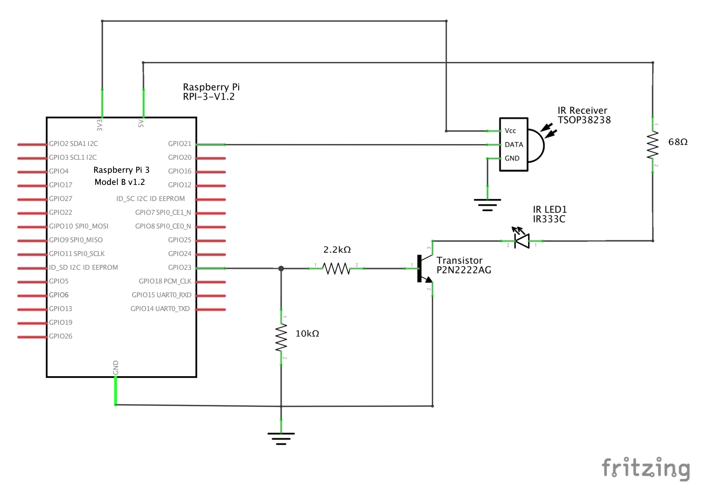

# 프로젝트 목표
- 사무실 내 3대의 에어컨을 음성 제어를 이용해 편하게 켜고 끄는게 목표입니다
- 에어컨 2대는 같은 브랜드, 다른 한대는 다른 브랜드라서 에어컨을 켤 때 리모콘을 두 개 찾아야 하는 불편함이 있는데 이를 해결하여 에어컨 리모컨을 찾는데 들어가는 시간을 절약하고 최종적으로 버즈빌 구성원들의 업무 효율성을 높이기 위함

# 구현 순서
- 라즈베리파이에 터미널 접속해서 커맨드 날려서 에어컨 켜고/끄기 구현
- 서버 띄워서 외부에서 접속하여 에어컨 켜고/끄기
- 슬랙으로 에어컨 켜고/끄기
- 아마존 에코로 에어컨 켜고/끄기
- 라즈베리파이 ip를 고정 ip대신에 유동 ip를 사용하고 자동적으로 네트워크상에서 기기를 찾아 요청을 보낼 수 있도록 네트워크 구성

# TODO
- [X] [회로도 그리기](#회로도)
- [ ] 빵판에 회로 만들기
- [ ] 리모컨에서 나오는 ir신호 캡쳐
- [ ] ir신호 생성해서 에어컨 제어하기
- [ ] 서버 셋업 
- [ ] 아마존 에코 연동
- [ ] 라즈베리파이 자동 검색 네트워크 구성 
- [ ] 만능 기판에 ir발신기 회로 구성

# 회로도 작성 툴 선택
- https://trends.google.com/trends/explore?q=fritzing,Eagle%20Cad,circuits.io
- https://ptarmiganlabs.com/blog/2013/08/27/fritzing-vs-circuits-io-vs-eagle-comparing-schematics-editors/
- fritzing vs Eagle Cad vs circuits.io ?
- fritzing이 무난해 보인다

# 라즈베리 파이 및 부품 구매
## 부품구매 사이트 추천

### 국내
- http://www.eleparts.co.kr/
- http://www.devicemart.co.kr/
- http://www.icbanq.com/

### 해외
- http://www.digikey.com/ -> 어디서 살 지 모르겠으면 여기서 사라
- https://www.ti.com/ -> 학교 메일 있으면 샘플을 공짜로 받을 수 있었던 것으로 기억

## 라즈베리파이 구매
- http://www.eleparts.co.kr/EPXGNNFF -> 케이스랑 아답터 있으면 좋을 것 같아서 세트로 구매. 아답터 같은경우 라즈베리파이 뿐만 아니라 보드에 들어갈 전원도 충분해야 하기 때문에 3A를 추천하는데 2.5A정도도 괜찮을듯?
- http://www.eleparts.co.kr/EPXDTWPM -> 입출력 키트. GPIO 케이블, 빵판, 저항, 스위치등 기본적인 회로구성하는데 필요한게 적절하게 들어있는 것 같음. 우선 써보고 좋으면 다른분들도 구매하면 좋을듯

## 메모리카드 구매
- http://m.blog.naver.com/alkydes/220699946626
- http://nogada-lab.tistory.com/13
- 결론은 mlc로 16기가 구매하기
- Sandisk micro sd extreme 16GB 구매
- 샌디스크 16기가가 대부분 품절이라 (http://www.wemakeprice.com/deal/adeal/1343369/?utm_source=naver_ep&utm_medium=PRICE_af&utm_campaign=1343369&src=text&kw=02413D) 에서 32기가 구매. (5번 32GB 무료배송)

# 개발 환경
## 라즈베리파이 운영체제 선택
- Android things, Ubuntu Mate, Raspbian 등이 있는 것 같음
- GUI쪽에 특별히 신경쓸게 아니라면 뭘 쓰던 상관 없는 것 같고 공식으로 지원하는 Raspbian이 아무래도 호환성이 좋을 듯 하고 레퍼런스 찾기도 쉬울 것 같아 좋지 않을까 생각함
- Raspbian도 데비안 기반이라 apt-get 명령도 쓸 수 있는등 우분투에 익숙하다면 쉽게 쓸 수 있을 것 같다

## sshfs 설정
- https://www.raspberrypi.org/documentation/remote-access/ssh/sshfs.md
- 맥에서 아래 명령 수행
```
brew install Caskroom/cask/osxfuse
brew install sshfs
mkdir pi
sshfs pi@192.168.0.109: pi
```

# 고민거리
- 환경 설정을 도커로 하면 이점이 있을까?
- 에어컨 3대를 제어하기 위해서는 ir 발신기가 장착된 라즈베리파이 3대가 필요한데 블루투스 -> 적외선 신호로 변환해주는 모듈이 어딘가 존재하지는 않을까? ir발신기의 유효 거리가 길지 않고 각도가 좁은게 문제인데 이를 해결할 방법이 있으면 좋겠다. 원가절감을 어떻게 할 것인가.
- 만능기판 레이아웃도 그려야하나?

# Study
## 회로
- 부품 주문 시 패키지 타입을 잘 체크하자. 예를들어 빵판에 회로 구현하는데 칩 저항 사면 못 붙인다. 고정저항(LEAD)을 주문해야함.
- 모든 부품은 인터넷에 찾아보면 데이터시트가 있으니 데이터시트 보는데 익숙해지자.

# 레퍼런스
## IR 제어
- [Setting up LIRC on the RaspberryPi](http://alexba.in/blog/2013/01/06/setting-up-lirc-on-the-raspberrypi/)
- [라즈베리파이로 에어컨 제어하기](http://pickykang.tistory.com/37)

# 회로도

Download [fritzing file(.fzz)](air-conditioner.fzz)
